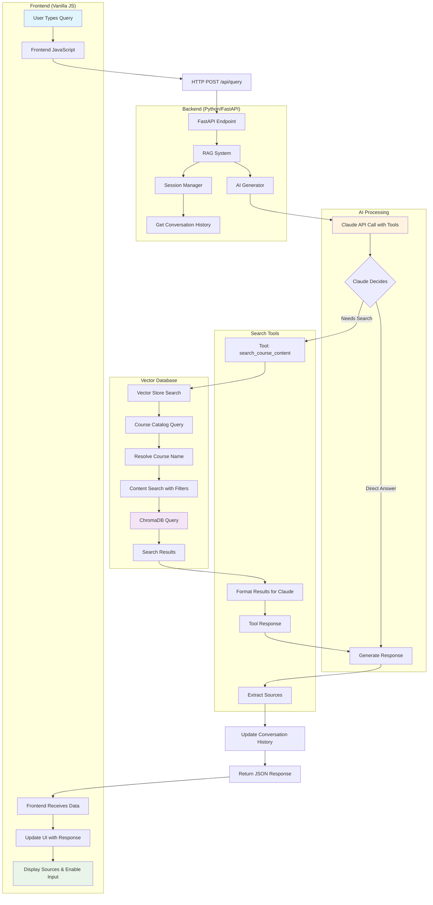

# Query Processing Flow: Frontend to Backend

This document traces the complete flow of how a user's query is processed through the RAG chatbot system, from frontend interaction to backend response generation.

## Architecture Overview

The system uses a **tool-based RAG architecture** where Claude dynamically calls search tools during response generation, rather than following a traditional pre-retrieval pattern.



## Detailed Flow

### 1. Frontend Query Initiation
**File**: `frontend/script.js:45-96`

**Process**:
1. User types query and presses Enter or clicks Send button
2. Input validation and UI state management
3. Display user message and loading animation
4. HTTP POST request to `/api/query`

**Code Flow**:
```javascript
// User input captured and validated
const query = chatInput.value.trim();
if (!query) return;

// UI state management
chatInput.disabled = true;
sendButton.disabled = true;
addMessage(query, 'user');  // Display user message
createLoadingMessage();     // Show loading animation

// API call
const response = await fetch(`${API_URL}/query`, {
    method: 'POST',
    headers: { 'Content-Type': 'application/json' },
    body: JSON.stringify({
        query: query,
        session_id: currentSessionId
    })
});
```

**Request Payload**:
```json
{
  "query": "user's question",
  "session_id": "current_session_id_or_null"
}
```

### 2. Backend API Endpoint Processing
**File**: `backend/app.py:56-74`

**Process**:
1. Receive and validate request
2. Create session if none provided
3. Delegate to RAG system
4. Return structured JSON response

**Code Flow**:
```python
@app.post("/api/query", response_model=QueryResponse)
async def query_documents(request: QueryRequest):
    # Session management
    session_id = request.session_id
    if not session_id:
        session_id = rag_system.session_manager.create_session()

    # Delegate to RAG system
    answer, sources = rag_system.query(request.query, session_id)

    # Return structured response
    return QueryResponse(
        answer=answer,
        sources=sources,
        session_id=session_id
    )
```

### 3. RAG System Query Orchestration
**File**: `backend/rag_system.py:102-140`

**Process**:
1. Create AI prompt with query context
2. Retrieve conversation history from session
3. Call AI generator with tool definitions
4. Extract sources from tool manager
5. Update conversation history

**Code Flow**:
```python
def query(self, query: str, session_id: Optional[str] = None):
    # Prompt preparation
    prompt = f"Answer this question about course materials: {query}"

    # Conversation context retrieval
    history = None
    if session_id:
        history = self.session_manager.get_conversation_history(session_id)

    # AI generation with tool access
    response = self.ai_generator.generate_response(
        query=prompt,
        conversation_history=history,
        tools=self.tool_manager.get_tool_definitions(),
        tool_manager=self.tool_manager
    )

    # Extract and reset sources
    sources = self.tool_manager.get_last_sources()
    self.tool_manager.reset_sources()

    # Update conversation history
    if session_id:
        self.session_manager.add_exchange(session_id, query, response)

    return response, sources
```

### 4. AI Generator with Tool Calling
**File**: `backend/ai_generator.py:50-87`

**Process**:
1. Prepare API parameters with tools
2. Make initial call to Claude API
3. Handle tool execution if requested
4. Return final response

**Code Flow**:
```python
def generate_response(self, query, conversation_history, tools, tool_manager):
    # Build system content with conversation history
    system_content = (
        f"{self.SYSTEM_PROMPT}\n\nPrevious conversation:\n{conversation_history}"
        if conversation_history
        else self.SYSTEM_PROMPT
    )

    # API call preparation
    api_params = {
        "model": "claude-sonnet-4-20250514",
        "messages": [{"role": "user", "content": query}],
        "system": system_content,
        "tools": tools,  # CourseSearchTool definition
        "tool_choice": {"type": "auto"}
    }

    # Initial response from Claude
    response = self.client.messages.create(**api_params)

    # Tool execution handling if Claude requests it
    if response.stop_reason == "tool_use" and tool_manager:
        return self._handle_tool_execution(response, api_params, tool_manager)

    return response.content[0].text
```

### 5. Tool-Based Search Execution
**File**: `backend/search_tools.py:52-74`

**Process** (when Claude calls `search_course_content` tool):
1. Execute vector store search with parameters
2. Handle search errors
3. Format results for Claude
4. Track sources for UI display

**Tool Definition**:
```json
{
    "name": "search_course_content",
    "description": "Search course materials with smart course name matching and lesson filtering",
    "input_schema": {
        "type": "object",
        "properties": {
            "query": {
                "type": "string",
                "description": "What to search for in the course content"
            },
            "course_name": {
                "type": "string",
                "description": "Course title (partial matches work, e.g. 'MCP', 'Introduction')"
            },
            "lesson_number": {
                "type": "integer",
                "description": "Specific lesson number to search within (e.g. 1, 2, 3)"
            }
        },
        "required": ["query"]
    }
}
```

**Code Flow**:
```python
def execute(self, query: str, course_name: Optional[str] = None, lesson_number: Optional[int] = None):
    # Use the vector store's unified search interface
    results = self.store.search(
        query=query,
        course_name=course_name,
        lesson_number=lesson_number
    )

    # Handle errors
    if results.error:
        return results.error

    # Format results and track sources
    return self._format_results(results)
```

### 6. Vector Store Search Process
**File**: `backend/vector_store.py:61-100`

**Two-Phase Search Strategy**:

#### Phase 1: Course Name Resolution
```python
def _resolve_course_name(self, course_name: str) -> Optional[str]:
    """Use vector search to find best matching course by name"""
    results = self.course_catalog.query(
        query_texts=[course_name],
        n_results=1
    )

    if results['documents'][0] and results['metadatas'][0]:
        return results['metadatas'][0][0]['title']
    return None
```

#### Phase 2: Content Search with Filtering
```python
def search(self, query: str, course_name: Optional[str] = None, lesson_number: Optional[int] = None):
    # Step 1: Resolve course name if provided
    course_title = None
    if course_name:
        course_title = self._resolve_course_name(course_name)

    # Step 2: Build filter for content search
    filter_dict = self._build_filter(course_title, lesson_number)

    # Step 3: Search course content with ChromaDB
    results = self.course_content.query(
        query_texts=[query],
        n_results=self.max_results,
        where=filter_dict  # ChromaDB filtering
    )

    return SearchResults.from_chroma(results)
```

**ChromaDB Collections**:
- `course_catalog`: Course metadata (titles, instructors) for semantic course resolution
- `course_content`: Actual course content chunks for content search

### 7. Response Assembly and Return

**Flow back through the stack**:
1. Vector store returns `SearchResults` with documents, metadata, distances
2. Search tool formats results with course/lesson headers and tracks sources
3. AI generator gets tool results and generates final response with Claude
4. RAG system captures sources from tool manager and updates conversation history
5. API endpoint wraps response in JSON structure
6. Frontend receives JSON and updates UI

### 8. Frontend Response Handling
**File**: `frontend/script.js:76-85`

**Process**:
1. Parse JSON response
2. Update session ID if new
3. Remove loading animation
4. Display response with markdown rendering and sources

**Code Flow**:
```javascript
const data = await response.json();

// Session management
if (!currentSessionId) {
    currentSessionId = data.session_id;
}

// Remove loading animation and display response
loadingMessage.remove();
addMessage(data.answer, 'assistant', data.sources);  // Markdown rendering + sources
```

**Response Format**:
```json
{
    "answer": "Generated response from Claude",
    "sources": ["Course 1 - Lesson 2", "Course 3 - Lesson 1"],
    "session_id": "unique_session_identifier"
}
```

## Key Architectural Patterns

### Tool-Based RAG
- Claude dynamically decides when and how to search
- Multiple searches per query are possible
- Enables query refinement and context-aware retrieval

### Two-Collection Vector Strategy
- Semantic course name resolution prevents cross-course contamination
- Metadata stored separately from content for efficient filtering
- Smart course matching handles partial/ambiguous names

### Session Management
- Stateful conversation context maintained in memory
- Stateless vector storage for scalability
- Configurable conversation history length (MAX_HISTORY: 2)

### Real-Time UI
- Loading states during AI generation
- Markdown rendering for formatted responses
- Collapsible source attribution
- Session persistence across page refreshes

## Configuration Parameters

Key settings that affect query processing behavior:

- `CHUNK_SIZE: 800` / `CHUNK_OVERLAP: 100`: Document chunking granularity
- `MAX_RESULTS: 5`: Search results limit per query
- `MAX_HISTORY: 2`: Conversation context window size
- `ANTHROPIC_MODEL`: "claude-sonnet-4-20250514"
- `EMBEDDING_MODEL`: "all-MiniLM-L6-v2"

## Data Flow Summary

```
1. User Query → Frontend JavaScript
2. HTTP POST → FastAPI Endpoint
3. Session Management → RAG System
4. Conversation Context → AI Generator
5. Tool Definitions → Claude API
6. Tool Calls → Search Tools
7. Vector Search → ChromaDB
8. Formatted Results → Claude Response
9. Source Tracking → JSON Response
10. UI Update → User Interface
```

This architecture enables sophisticated question-answering with context-aware search, conversation continuity, and intelligent course material retrieval.